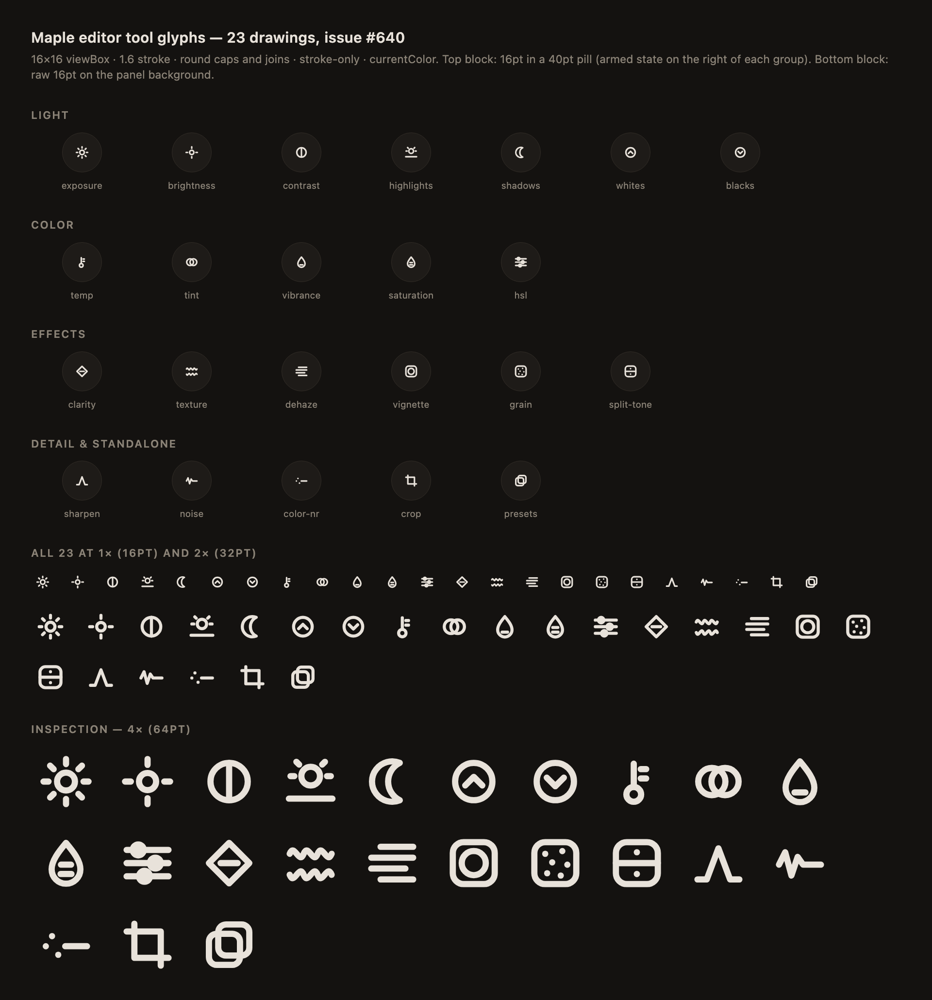
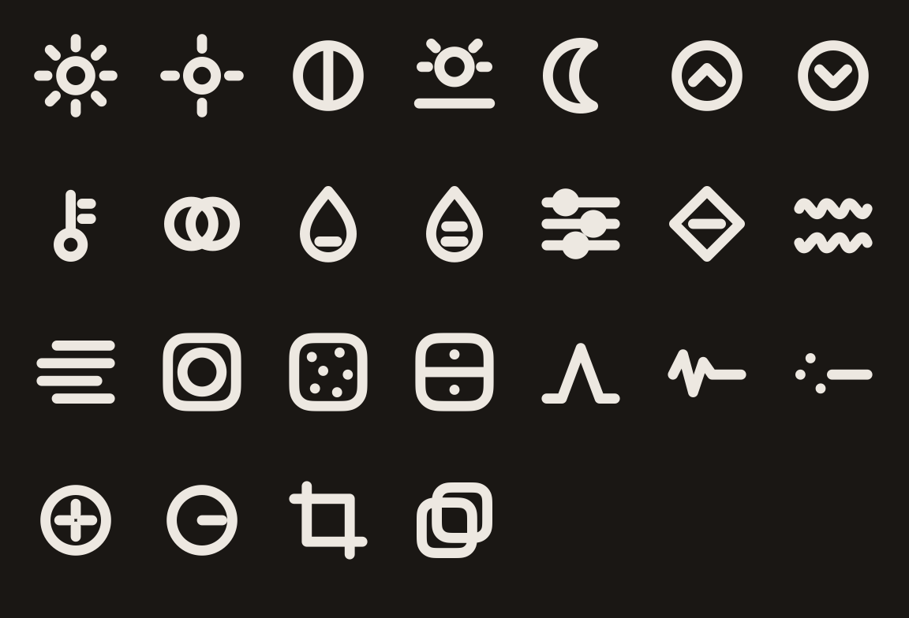

# Responsive Program — S0c: Icon Parity Table

Companion to the S0 primitives spec (`docs/design/responsive-program/s0-primitives.md` §4). Establishes the canonical mapping from each chrome glyph used by S1–S7 to its Apple (SF Symbol) and Web (`maple-icon` registry name) implementations.

Two categories live in the responsive program:

- **Chrome glyphs** — navigation chevrons, action icons, source-kind icons. Most map to a generic SF Symbol on Apple; the web side renders 16×16 stroked SVGs out of `maple-icon`. **S0c ships these.**
- **Tool glyphs (22)** — Exposure, Contrast, Highlights, Shadows, Whites, Blacks, Temp, Tint, Vibrance, Saturation, HSL, Clarity, Texture, Dehaze, Vignette, Grain, Split tone, Sharpen, Noise, Color NR, Crop, Presets. SF Symbols has no Lightroom-style photo-editing glyphs — custom illustration required. **Deferred to S5 (Editor)**; tracked by a follow-up issue referenced from the S0c PR.

## Parity table

The web names below are the **actual registry names** in `src/web/projects/maple-common/src/lib/icons/maple-icon-registry.ts`. Where a semantic equivalent already exists, the existing name is reused — adding aliases would bloat the registry without behavioural benefit. The spec name column is the canonical reference vocabulary used in S1–S7 prose.

| Spec name              | Used in                              | Apple (SF Symbol)            | Web (maple-icon name)                                                 |
| ---------------------- | ------------------------------------ | ---------------------------- | --------------------------------------------------------------------- |
| `back`                 | Editor / Loupe header (no title bar) | `chevron.left`               | `chevron-left` _(new in this PR)_                                     |
| `overflow`             | Library header right                 | `ellipsis`                   | `ellipsis-horizontal` _(new in this PR)_                              |
| `close-x`              | Sidebar collapse, Info sheet         | `xmark`                      | `x` _(existing — two-line X)_                                         |
| `share`                | Loupe / Editor header (stub)         | `square.and.arrow.up`        | `share-up-square` _(new in this PR)_                                  |
| `undo`                 | Editor header                        | `arrow.uturn.backward`       | `undo-uturn` _(new in this PR)_                                       |
| `redo`                 | Editor header (long-press)           | `arrow.uturn.forward`        | `redo-uturn` _(new in this PR)_                                       |
| `info`                 | Loupe / Editor header                | `info.circle`                | `info` _(existing — circle + dot + bar)_                              |
| `search`               | Sidebar pill                         | `magnifyingglass`            | `search` _(existing — circle + handle)_                               |
| `clear-circle`         | Search field trailing                | `xmark.circle.fill`          | `clear-circle-fill` _(new in this PR)_                                |
| `plus`                 | Add album header                     | `plus`                       | `plus` _(existing)_                                                   |
| `eyedropper`           | Color tab WB                         | `eyedropper`                 | `eyedrop` _(existing)_                                                |
| `folder-source`        | Sidebar                              | `folder`                     | `folder` _(existing — outline folder)_                                |
| `smart-source`         | Sidebar                              | `wand.and.stars`             | `smart-source-wand` _(new in this PR)_                                |
| `album`                | Sidebar                              | `rectangle.stack.fill`       | `album-stack` _(new in this PR)_                                      |
| `place`                | Search top hit                       | `mappin.circle.fill`         | `map-pin` _(existing — outline pin + dot)_                            |
| `keyword`              | Search top hit, Info chip            | `number`                     | `keyword-hash` _(new in this PR)_                                     |
| `person`               | Search top hit                       | `person.crop.circle.fill`    | `person-circle` _(new in this PR)_                                    |
| `pick-dot` (primitive) | Grid badge, Info pill                | drawn as `Circle`, no glyph  | drawn as `
`, no glyph (use `dot` if a 1-shape variant is needed) |
| `star` (existing)      | Grid badge, ratings                  | `star.fill` (in `StarView`)  | `star-filled` _(existing)_                                            |
| `flag-pick` (existing) | Info pill                            | `flag.fill` (in `FlagBadge`) | `flag` _(existing — outline)_                                         |

`hamburger` (`line.3.horizontal`) is **N/A**: phone uses tab bar; tablet/desktop sidebar is always-on. No registry entry planned.

### Notes on existing-name reuse

A handful of spec names differ in spelling from the existing registry entry that already covers their semantics:

- **`close-x` → `x`.** The existing `x` is a two-line stroked X — visually equivalent to SF `xmark` at 16×16. No reason to duplicate.
- **`info-circle` → `info`.** Existing `info` is a circle with a dot + bar, matching SF `info.circle`.
- **`magnifying-glass` → `search`.** Existing `search` is the conventional circle + diagonal handle.
- **`eyedropper` → `eyedrop`.** Naming nit only.
- **`folder-source` → `folder`.** No specialised "source" affordance distinguishes a folder source from a generic folder at 16×16.
- **`place-pin` → `map-pin`.** Existing pin already has the centre dot SF `mappin.circle` implies.

The S1–S7 specs may reference the spec-canonical name (left column); implementations wire to the registry name (right column). This doc is the bridge.

### Notes on `flag-pick`

`flag.fill` (Apple) is a filled flag used as the visual marker on the picked-image pill. The existing web `flag` is **outline-only** (single path drawing the staff and pennant). For S0c, we leave `flag` as-is; if filled-flag becomes a hard requirement during S5 Editor or S6 Inspector implementation, a `flag-filled` glyph will be added then. Tracked informally; no separate issue today.

## Web SVG conventions

The existing `maple-icon` registry has established conventions that all new glyphs in this PR match for consistency:

- **viewBox:** `"0 0 16 16"`
- **Stroke:** `currentColor` (component `color` input, default `'currentColor'`)
- **Stroke-width:** **1.5** (the component default — the umbrella spec proposed 1.6, but matching the existing default keeps the visual line weight consistent across all `maple-icon` glyphs)
- **Stroke caps / joins:** `round` / `round` (template default; `sharp: true` opt-out on rect primitives that need 90° corners — grid icons only)
- **Fill:** `none` for outline glyphs; `filled: true` on a shape flips the path to filled and drops the stroke (used by `star-filled`, `dot`, `clear-circle-fill`)
- **Naming:** kebab-case (e.g. `chevron-left`, `clear-circle-fill`, `keyword-hash`)

The 1.6 vs 1.5 stroke-width delta from the umbrella spec is documented here so future S0c follow-ups can decide whether to migrate the entire registry to 1.6 in a single coordinated PR (rather than mixing weights mid-flight).

## Glyphs added in this PR

| Web name              | Path source                                                  | Notes                                                                                                                         |
| --------------------- | ------------------------------------------------------------ | ----------------------------------------------------------------------------------------------------------------------------- |
| `chevron-left`        | Hand-rolled — mirror of existing `chevron-right`             | `M10 3l-5 5 5 5`                                                                                                              |
| `ellipsis-horizontal` | Hand-rolled — three filled circles                           | `cx=4,8,12`, `cy=8`, `r=1`, filled                                                                                            |
| `share-up-square`     | Heroicons `arrow-up-tray` rescaled 24→16                     | Up-arrow above an open tray, distinct from existing `export` (arrow + base)                                                   |
| `undo-uturn`          | Hand-rolled — half-loop + arrowhead                          | U-turn returning left                                                                                                         |
| `redo-uturn`          | Hand-rolled — mirror of `undo-uturn`                         | U-turn returning right                                                                                                        |
| `clear-circle-fill`   | Hand-rolled — filled circle + stroked X overlay              | Two shapes: filled disc + outline X (rendered on top, currentColor on a filled background relies on consumer setting `color`) |
| `smart-source-wand`   | Heroicons `sparkles` + wand staff                            | Diagonal wand with a sparkle on the tip                                                                                       |
| `album-stack`         | Hand-rolled — three offset stacked rectangles                | Mimics SF `rectangle.stack.fill` (outline at 16×16)                                                                           |
| `keyword-hash`        | Hand-rolled — `#` glyph                                      | Two verticals, two horizontals                                                                                                |
| `person-circle`       | Hand-rolled — head circle + shoulders within an outer circle | Mirrors SF `person.crop.circle.fill` shape language                                                                           |

## Follow-up issue

Tracked in [#587](https://github.com/zubair-io/Maple/issues/587) — _"Design 22 photo-tool glyphs for editor pill row"_, owned by S5 (Editor). Covers Exposure, Contrast, Highlights, Shadows, Whites, Blacks, Temp, Tint, Vibrance, Saturation, HSL, Clarity, Texture, Dehaze, Vignette, Grain, Split tone, Sharpen, Noise, Color NR, Crop, Presets. SF Symbols has no Lightroom-style photo-editing glyphs — custom illustration required. Deferred from S0c so chrome work in S1–S4 isn't blocked on illustration.

The same 23 drawings plus the two Apple-only capture-sharpening glyphs, rendered through the Swift path reader in `ToolGlyph.swift` — this is the parity evidence, not a redraw:

**Closed by [#640](https://github.com/zubair-io/Maple/issues/640).** The final set (23 drawings — the 22 above plus Brightness from #1108) is hand-authored path data in `icons/tool-glyph-shapes.ts`, mirrored verbatim by `src/apple/Maple/Views/ToolGlyphShapes.swift` so both platforms render the identical drawing. Unlike the chrome glyphs, the tool set is drawn to the umbrella spec's **1.6** stroke rather than the registry default 1.5, and carries that weight per-shape so it survives a caller that renders at a different size.
