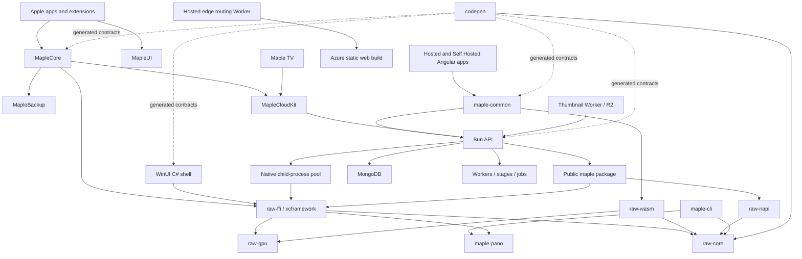

# Engineering map

Source snapshot: `1f233acb91dd97c2103a6903279be4dee5329192`, fetched from
`origin/main` on 2026-09-15. This is a responsibility map and structural audit,
not a claim that every implementation has been exercised. The companion
[quality assessment](engineering-quality.md) separates verified findings,
structural observations, and unverified scan candidates.

## Scale and how to navigate

The snapshot contains 27,612 tracked files. Of those, 21,039 are under the
vendored or patched dependency trees. The inventory separates these from
Maple-authored code and identifies generated/distributed outputs by path.

| Area                     | Authored source files | Physical lines | Test/story files |
| ------------------------ | --------------------: | -------------: | ---------------: |
| Rust engine and bindings |                 1,001 |        263,052 |              251 |
| Apple                    |                 1,563 |        241,804 |              590 |
| Web                      |                 1,691 |        207,624 |              546 |
| API                      |                   999 |        192,283 |              508 |
| Windows                  |                   562 |         73,229 |              127 |
| Public image package     |                    50 |         10,959 |               17 |
| Cloudflare               |                    20 |          1,626 |                8 |
| Shared tools             |                    33 |          6,368 |                2 |
| Script harnesses         |                    65 |         12,835 |                6 |

Physical lines include comments, blanks, and tests. Classification is a
path heuristic; inline Rust tests remain in their implementation file.
These are navigation measurements, not coverage or quality scores.

- [Source inventory](engineering-audit/source-inventory.csv): every tracked
  first-party source file in the supported extensions, with area, module,
  classification, and line count.
- [Module inventory](engineering-audit/module-inventory.csv): aggregated
  ownership groups, including smaller API subsystems.
- [Inventory metadata](engineering-audit/inventory-summary.json): exact
  revision, exclusions, extensions, and counts.
- Reproduce from committed blobs with
  `python3 tools/audit-codebase.py --ref 1f233acb91dd97c2103a6903279be4dee5329192 --out /tmp/maple-inventory`.

## Runtime and dependency map

Arrows represent use, not ownership of the same process. Feature flags control
optional Rust dependencies. The public package has different Bun and Node
execution paths. Its worker threads protect responsiveness; the API's child
processes additionally isolate native crashes. They are not interchangeable.
Sources: workspace and package manifests, `src/maple/src/worker-pool.ts`,
`src/api/src/index.ts`, and `src/windows/Maple.WinUI/Maple.WinUI.csproj`.

## Rust: shared computation and contracts

Root: `src/raw-pipeline/`. `Cargo.toml` declares eight workspace members.

| Unit                                                         | Responsibility                                                                          | Important boundaries / evidence                                                        |
| ------------------------------------------------------------ | --------------------------------------------------------------------------------------- | -------------------------------------------------------------------------------------- |
| `raw-core`                                                   | RAW/raster decoding, calibration, CPU image math, model/schema, XMP, export             | `src/lib.rs`, `src/types/`, `src/pipeline/`, `src/xmp/`; authoritative image semantics |
| `raw-core/src/color`, `demosaic`, `stages`, `view`           | Camera transforms, demosaic, scene adjustments, final view/output transform             | CPU reference; distinct from platform scheduling                                       |
| `raw-core/src/raster*`                                       | General image recipes: geometry, resizing, alpha, filters, encoding, metadata, analysis | Also backs the public package; the core now serves more than the editor                |
| `raw-core/src/lens_profile`, `film*`, `scope`                | Optical corrections, film looks, scope calculations                                     | Shared product behavior                                                                |
| `raw-core/src/types`, `capability_registry`, `support_tiers` | Adjustment schema, qualification evidence, supported-camera/lens classification         | Inputs to generated client declarations and release summaries                          |
| `raw-gpu`                                                    | Persistent GPU rendering and WGSL stages on Metal/WebGPU/Vulkan/DX12                    | `src/lib.rs`, stage modules, live/present modules; parity against CPU                  |
| `raw-ffi`                                                    | C ABI, owned/borrowed buffers, decode/render/live sessions, native exports              | `src/lib.rs`, `abi_layout.rs`, `gpu_live/`; platform memory boundary                   |
| `raw-wasm`                                                   | Browser bindings, live surface, export, metadata, shared heap                           | `src/lib.rs`, `web_live_session.rs`; JS/Rust ownership and scheduling boundary         |
| `raw-napi`                                                   | Node native addon for the public image package                                          | `Cargo.toml`, `src/lib.rs`; additional binding beyond the older four-binding summary   |
| `maple-cli`                                                  | Headless processing, deterministic batch harness, panorama command                      | Executable used by diagnostics and product panorama flows                              |
| `maple-pano`                                                 | Panorama feature extraction, matching, alignment and blending                           | Separate ML/model provisioning and feature-gated runtime requirements                  |
| `codegen`                                                    | Emits shared schemas, tokens, matrices, catalogs and qualification summaries            | `src/main.rs`, `tools/codegen.sh`; output targets vary by schema                       |
| `vendor`, `third_party`, `patches`                           | Reproducible dependencies and maintained upstream patches                               | Excluded from first-party quality counts; upgrade obligations remain                   |

**Assessment:** strong central ownership of image computation and substantial
parity infrastructure. Remaining hand-maintained declarations are documented
in the quality assessment. CPU/GPU implementations are intentionally distinct;
duplication alone is not a reason to merge the reference and implementation.

## Apple: applications, domain coordination and reusable UI

Root: `src/apple/`. The Xcode project owns app/extension packaging; SwiftPM
packages own reusable code. `MapleCore/Package.swift` exposes both MapleCore
and MapleCloudKit, and deliberately stays in Swift 5 language mode.

| Unit                                                      | Responsibility                                                                  | Quality / ownership observation                                                                            |
| --------------------------------------------------------- | ------------------------------------------------------------------------------- | ---------------------------------------------------------------------------------------------------------- |
| `Maple/`                                                  | SwiftUI shell, library/editor screens, auth and backup presentation             | AppShell and LibrarySidebar remain large; application composition is still concentrated                    |
| `Packages/MapleCore/Sources/MapleCore`                    | EditSession, RenderActor, render bridges, XMP, assets and platform I/O          | Clear actor and cancellation intent; broad package and extension-based type decomposition                  |
| `MapleCore/.../Sources`, `FileProvider`, `FileOperations` | Local/remote source adapters, OS file-provider coordination and file operations | Separate from image math; FileProviderExtensionCore and RemoteCatalog are size hotspots                    |
| `MapleCore/.../Export`, `Panorama`, `Masks`, `Retouch`    | Editing workflows and orchestration around shared processing                    | Review semantic behavior at Rust/binding boundaries, not just Swift file boundaries                        |
| `MapleCore/.../Cache`, root asset types                   | Cached previews/assets and lifecycle state                                      | The detailed cache ownership contract is `docs/caching.md`                                                 |
| `MapleCore/Sources/MapleCloudKit`                         | Server auth, pairing, cloud browsing, downloads, search/map clients             | A separate target usable by TV without linking the RAW engine; name does not mean Apple's CloudKit service |
| `Packages/MapleUI`                                        | Atoms, molecules, organisms, templates/pages and gallery                        | Package manifest has no MapleCore or third-party dependency: a useful enforceable boundary                 |
| `Packages/MapleBackup`                                    | PhotoKit reads, durable backup state, queueing, upload/retry and progress       | Separate actors and tests; used by app/core integration                                                    |
| `Maple TV`                                                | TV browsing/playback and pairing UI                                             | Consumes cloud networking independently of the RAW editor                                                  |
| `MapleFileProvider`, `MapleFileProviderIOS`               | OS extension entry points                                                       | Thin wrappers around core provider implementation                                                          |
| `MapleQuickLook`, `MapleWidget`, `MapleBackupAgent`       | Quick Look, widget and background-agent entry points                            | Separate deployment/lifecycle surfaces                                                                     |
| `MapleTests`, `MapleUITests`, package `Tests`             | App tests, visual workflow harnesses and package tests                          | Existence does not imply CI execution; see measured execution inventory                                    |
| `Frameworks`, `scripts`, `ci_scripts`                     | Native binary headers/build and Xcode Cloud bootstrap                           | Native artifacts need rebuilding when Rust changes                                                         |

Sources: package manifests; `EditSession.swift`, `RenderActor.swift`,
`BackupEngine.swift`, Xcode project and target directories.

## Web: a shared implementation with two product compositions

Root: `src/web/`. The two applications are small relative to the common library.

| Unit                                                                 | Responsibility                                                         | Quality / ownership observation                                                    |
| -------------------------------------------------------------------- | ---------------------------------------------------------------------- | ---------------------------------------------------------------------------------- |
| `projects/maple`                                                     | Self Hosted routing, sign-in and operator settings                     | Settings contain repeated loading/saving patterns; shared UI adoption is ratcheted |
| `projects/maple-syrup`                                               | Hosted entry, landing/editor route and UI gallery                      | Browser-only capability boundary has a dedicated checker                           |
| `maple-common/src/lib/ui`                                            | Shared UI components                                                   | Large real adoption investment; adoption checker covers specified migrated scopes  |
| `.../components`, `shells`, `editor`                                 | Browse/editor composition, grid, canvas, crop, inspector, tool routing | Application behavior above UI primitives; canvas/crop are complexity hotspots      |
| `.../state`, `workspace`, `library`, `folder-access`                 | Selection, browsing, editing state and source access                   | Library fetch/store are concentration points                                       |
| `.../api`, `auth`, `network`                                         | Backend contracts, implementations and authentication                  | Bun API backend remains a large adapter                                            |
| `.../raw-pipeline`                                                   | Worker RPC, WASM lifetime, GPU presentation and exports                | Owns browser coordination, not independent color mathematics                       |
| `.../xmp`, `models`, `generated`                                     | Persistence format, domain values and generated contracts              | Some metadata vocabularies still maintained outside codegen                        |
| `.../addressing`, `deep-link`                                        | Stable image IDs, library slugs and navigation addresses               | Duplicated ID implementation has a confirmed divergence                            |
| `.../batch-metadata`, `batch-rename`, `drag-move`, `trash`, `rename` | Multi-asset/file workflows                                             | Repeated field mappings and failure semantics need coordinated ownership           |
| `.../export`, `film`, `lens`, `pano`                                 | Output recipes and editing integrations                                | Consumers of core capabilities, with platform provisioning concerns                |
| `.../search`, `map`, `info`                                          | Discovery and metadata presentation                                    | API-client composition and view models                                             |
| `.../maple-cache`, `sw`, `observability`                             | Local caching, app updates and telemetry                               | Distinct lifetimes from image rendering                                            |
| `e2e`, `.storybook`, `scripts`                                       | Product browser tests, component stories and build/contract checks     | Separate from runtime library; hardware/fixture limits apply                       |

Sources: `angular.json`, `package.json`, common-library imports and exports,
`raw-pipeline.service.ts`, `batch-metadata-panel.form-mapping.ts`, and the
UI adoption checker. Full first-party file inventory is linked above.

## API: HTTP, persistence and background orchestration

Root: `src/api/src/`. `index.ts` composes routes and startup. MongoDB is
accessed through the shared client and domain repositories. The worker tier
and native decode processes have separate lifetimes.

| Unit                                              | Responsibility                                                                                 | Quality / ownership observation                                          |
| ------------------------------------------------- | ---------------------------------------------------------------------------------------------- | ------------------------------------------------------------------------ |
| `routes`, `middleware`                            | HTTP contracts, request limits, authentication integration, UI serving                         | Large route composition and per-field validation are complexity hotspots |
| `auth`, `apns`                                    | Sessions/passkeys/native handoff and push notifications                                        | Security-sensitive; this audit does not certify security                 |
| `db`                                              | Collections, schemas, indexes and boot migrations                                              | Large central files; confirmed dependency cycle through people migration |
| `indexer`                                         | Asset discovery records, stable IDs, EXIF and indexing helpers                                 | Legacy repository refers to a deleted channel module                     |
| `workers`                                         | Per-asset claiming, concurrency, retries, status and supervision                               | Generic stage machinery is a strength; registration remains repeated     |
| `workers/stages`                                  | EXIF, derivatives, face analysis, descriptions, geocode, search sync, transcription, edge sync | Names/definitions/starters are independently listed                      |
| `job-runner`, `imports`, `export`, `pano`         | Bounded user-requested jobs and imports/exports                                                | Distinct from eventual per-asset enrichment                              |
| `enrichment`, `people`                            | Vision, OCR, embeddings, search indexing and person clustering                                 | Significant test investment, but complexity and dependency cycles remain |
| `fs`, `library`, `backup`                         | Filesystem access/mirroring, library addressing, upload and organization                       | Shared helpers exist, with some route-local duplicates still present     |
| `ffi`, `thumbs`, `render`                         | Native process pool, thumbnail/preview production, render configuration                        | Crash isolation differs from the public package's thread pool            |
| `xmp`, `metadata`, `presets`, `lens-profiles`     | Sidecar metadata and reusable editing resources                                                | Client/core schema tables are sometimes copied with parity tests         |
| `cloudflare`, `video`, `audio`                    | Edge-cache upload/cleanup and media extraction                                                 | External service/process boundaries                                      |
| `runtime`, `process`, `network`, `observability`  | Child lifecycle, runtime diagnostics, networking and telemetry                                 | Infrastructure should stay separate from feature rules                   |
| `map`, `display`, `handler-registry`, `generated` | Map configuration, display helpers, handler discovery and generated DTOs                       | Smaller modules are enumerated in the module inventory                   |

## Windows: WinUI is the product shell

Root: `src/windows/`. `Maple.WinUI` calls `raw_ffi.dll` directly through
P/Invoke; it does not run through the diagnostic `maple-windows` executable.

| Unit                                           | Responsibility                                                     | Quality / ownership observation                                              |
| ---------------------------------------------- | ------------------------------------------------------------------ | ---------------------------------------------------------------------------- |
| `Maple.WinUI/MainWindow*`, `Views`, `Controls` | Window composition, interaction wiring and native canvas           | MainWindow spans 29 C# files / 5,932 physical lines                          |
| `ViewModels`, `Models`                         | Edit session, selection and adjustment state                       | Partial classes distribute behavior across files                             |
| `Services`                                     | Render scheduling, XMP, cloud/files, export, metadata and settings | Real service boundaries exist; not all behavior lives in the window          |
| `Native`                                       | P/Invoke declarations, ABI layout and parameter mapping            | Hand-maintained layout guarded by native struct-layout tests                 |
| `MapleUI`, `Themes`, `Generated`               | Windows UI components and generated tokens/contracts               | Reusable namespace inside the app project, unlike Apple's standalone package |
| `Maple.WinUI.Tests`                            | Linked-source service/UI logic and native ABI tests                | CI executes these; interactive qualification is a separate harness           |
| `src`, `Cargo.toml`                            | Small diagnostic Rust host and file watcher                        | Still built in CI; not the production shell                                  |
| `tauri.conf.json`, optional `tauri-build`      | Residual alternate-shell configuration                             | Documented as inert in `docs/windows.md`; no Tauri runtime is launched       |
| `installer`, `scripts`                         | Packaging and local/qualification commands                         | Local build wrapper's target/SDK handling differs from its success message   |

## Public package, edge services and repository tooling

| Unit                               | Responsibility                                                                 | Quality / ownership observation                                                                           |
| ---------------------------------- | ------------------------------------------------------------------------------ | --------------------------------------------------------------------------------------------------------- |
| `src/maple/src`                    | Public fluent image API, validation, native adapters, worker execution and CLI | Genuine separate consumer of raw-core; queued requests retain arguments without a visible admission bound |
| `src/maple/dist`, `npm`, `scripts` | Distributed JS/types, platform packages and release assembly                   | Distributed outputs are separated from authored-source metrics                                            |
| `src/cloudflare/src`               | Authenticated thumbnail R2 lookup, origin fallback and image-format handling   | Key derivation is copied from API; independent deployment still shares semantic contracts                 |
| `src/cloudflare/ssr`               | Hosted origin proxy, SPA fallback, headers and WASM MIME handling              | Despite name, it is an edge routing/header layer rather than Angular server rendering                     |
| `.github/workflows`                | Platform checks, cross-cutting gates and publishing                            | Checks differ in scope and enforcement; see quality assessment                                            |
| `tools`, `src/scripts`             | Codegen, qualification, color/performance analysis and maintenance             | Existing tools should remain authoritative instead of duplicating gates in audit scripts                  |
| `test-fixtures`                    | Contract corpora, references, budgets and qualification records                | Large RAWs are not committed; absence changes what a passing run proves                                   |
| `resources/film-luts`              | Shared film assets                                                             | Asset data, not handwritten implementation                                                                |
| `docs`                             | Product, component, architecture and testing reference                         | Some overview statements lag source; detailed platform docs can be more accurate                          |

## Ownership rules visible in the current tree

1. Image mathematics and shared image contracts center on Rust.
2. Platform shells own gestures, OS integration and lifecycle.
3. Shared UI owns presentation primitives; domain stores/services supply state.
4. The API owns server storage, operator settings and worker orchestration.
5. XMP implementations are platform-specific, with a shared persistence contract.
6. Codegen and parity tests are different mechanisms: generation removes manual
   copies, while parity tests detect divergence between copies that remain.

The main architectural debt is at these boundaries: duplicated knowledge,
incomplete migration cleanup, and large orchestration types whose file splits
do not provide independent ownership. See the evidence in the companion assessment.
