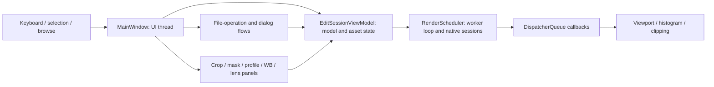
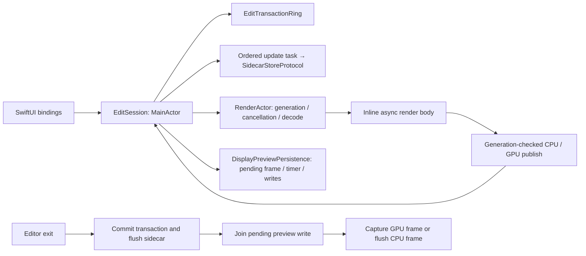

# Editor state and lifecycle boundaries

Investigation for #3665, initially inspected at `9169b88bd` (2026-09-16); Apple persistence ownership below is updated through `306a8146bb` / #3729. This is a source map, not runtime qualification. At the original inspection, Windows `MainWindow*.cs` spanned 29 files / 5,932 physical lines; Apple `EditSession*.swift` spanned 28 files / 4,800 lines. Counts include comments and blank lines and exclude XAML, collaborators and tests. Partial declarations and Swift extensions share the same object; the file splits do not enforce ownership.

## Findings

- Preserve the existing Windows view-model/renderer and Apple MainActor/RenderActor boundaries. Moving all editor behavior into a new service would obscure them.
- Windows window acquisition and shutdown are insufficiently paired: the constructor acquires a COM panel reference, while window close delegates only to the view model. Track the concrete lifetime repair in [#3702](https://github.com/zubair-io/Maple/issues/3702).
- Apple preview persistence originally coordinated three shared properties across CPU and GPU extensions. [#3729](https://github.com/zubair-io/Maple/pull/3729) completed [#3703](https://github.com/zubair-io/Maple/issues/3703): one concrete MainActor owner now encapsulates pending frames, debounce and in-flight writes while the session retains exit ordering and model/generation guards.
- Other splits below are navigation aids, not recommendations for new abstractions. Rendering, cancellation and model provenance need qualification before any extraction.

## Windows: one window, several existing owners

Source root: [`src/windows/Maple.WinUI`](../src/windows/Maple.WinUI/).

### State and cross-file map

| Behavior                        | Files / entry points                                                                                                                | Shared state and collaborators                                                                                                                                             | Boundary to preserve                                                                                                                  |
| ------------------------------- | ----------------------------------------------------------------------------------------------------------------------------------- | -------------------------------------------------------------------------------------------------------------------------------------------------------------------------- | ------------------------------------------------------------------------------------------------------------------------------------- |
| Construction, mode and disposal | [MainWindow.xaml.cs](../src/windows/Maple.WinUI/MainWindow.xaml.cs): constructor, `SetMode`, `EnterPreview`, `Closed`               | `ViewModel`, `_mode`, `_settings`, `_panelNative`, renderer event subscriptions                                                                                            | XAML objects and mode transitions stay on UI thread; renderer must stop using panel before its reference is released.                 |
| Browse and selection            | `Browse`, `Selection`, `Filmstrip`, `Keyboard`, `Actions` partials                                                                  | `SelectedPhoto`, `SelectedPhotos`, `_previewSubscribed`, `_railPhotos`, `_railBitmaps`, `_railDirty`; calls `SetMode`, `OnSelectedPhotoChanged`, `SyncFilmstripRailActive` | Single-photo viewer target is distinct from multi-selection; selection resets zoom, frame dimensions and clipping.                    |
| Frame presentation and tools    | [Viewport](../src/windows/Maple.WinUI/MainWindow.Viewport.cs), `ClipOverlay`, `Crop`, `Mask`                                        | `_viewportBitmap`, `_gpuFrameDims`, `_lastHistogramBins`, pan state, reusable clip scratch, `_cropArmed`, `_maskArmed`; `UpdatePanelFit` calls crop/mask display updates   | Renderer callbacks enqueue UI work. Keep physical-pixel/DIP conversion and allocation-free scratch reuse.                             |
| Inspector controls              | `Panels`, `WhiteBalance`, `Profile`, `LensProfile`, `CameraSupport`                                                                 | `_activeGroup`, curve channel, grade wheels, syncing flags, picker state; `ModelSynced` fans out to panel synchronization                                                  | Controls write through the view model. Picker arming and keyboard cancellation remain coherent.                                       |
| Modal and file operations       | `Dialogs`, `DragDrop`, `DropMount`, `FolderContextMenu`, `MoveToFolder`, `Rename`, `BatchRename`, `Trash`, `TrashRestore`, `Reveal` | `_modalFlowGate`, `_deleteGate`, `_restoreGate`, `_dropGate`, `_renameCommitInFlight`, `_messageDialogGate`; services/view-model perform operations                        | Single-flight decisions cross partials; moving one handler must not create an independent gate. Preserve collision/sidecar semantics. |
| Export and panorama             | `ExportRecipes`, `ExportQueue`, `Pano`                                                                                              | Recipe services, cancellation tokens and shared modal flow gate                                                                                                            | Existing asynchronous ownership and disposal stay with each operation; no render-loop rewrite.                                        |
| Qualification                   | `Qualify`                                                                                                                           | Existing diagnostic/qualification entry from constructor                                                                                                                   | Harness reachability is not proof that normal window close is exercised.                                                              |

The strongest lexical cross-partial state indicators are `_mode` (8 files), `_deleteGate` (5), `_modalFlowGate` and `_lastHistogramBins` (4 each), `_viewportBitmap` and `_gpuFrameDims` (3 each). These are whole-word source occurrences including comments, not an AST call graph or runtime frequency measure. They identify review clusters; they do not measure defects.

### Actual lifecycle chain

1. Constructor creates `EditSessionViewModel`, subscribes renderer/UI events and obtains `ISwapChainPanelNative` with `Marshal.QueryInterface`.
2. [`RenderScheduler.SetPresentTarget`](../src/windows/Maple.WinUI/Services/RenderScheduler.cs) stores the pointer under its gate; it does not document ownership transfer or release it.
3. `Closed` calls [`EditSessionViewModel.Dispose`](../src/windows/Maple.WinUI/ViewModels/EditSessionViewModel.cs), which cancels decode, disposes timers/watchers and calls `Renderer.Dispose`.
4. Renderer disposal cancels its loop, signals it and closes the GPU session under its gate. The inspected chain has no balancing `Marshal.Release` for the window's QueryInterface reference and no awaited loop-completion barrier exposed to the window.

This is concrete ownership evidence, not a measured leak magnitude. #3702 must establish safe native shutdown order before adding release. `_cloudFiles` is constructed in the window and used in `Dialogs`; its ownership must also be accounted for explicitly, rather than assumed to belong to the view model.

### Existing evidence and gaps

[`Maple.WinUI.Tests.csproj`](../src/windows/Maple.WinUI.Tests/Maple.WinUI.Tests.csproj) links portable logic/services into a .NET test project. Existing `ViewerFilmstripLogicTests`, `WhiteBalancePickLogicTests`, `SingleFlightGateTests`, `BatchRenameLogicTests`, `RenameReconciliationLogicTests`, `TrashSelectionLogicTests`, `RelocateCrashSafetyTests` and XMP tests cover useful extracted decisions and file contracts. They do **not** construct the WinUI `MainWindow` and therefore do not certify its event attachment, dispatcher callbacks or COM teardown. A real Windows window smoke is required for #3702.

## Apple: observable session plus actor-owned work

Source root: [`MapleCore`](../src/apple/Packages/MapleCore/Sources/MapleCore/).

### State and cross-file map

| Behavior                          | Extensions / entry points                                                                                                                                                                                                                                                                                                  | Shared state and collaborators                                                                                        | Boundary to preserve                                                                                                                                              |
| --------------------------------- | -------------------------------------------------------------------------------------------------------------------------------------------------------------------------------------------------------------------------------------------------------------------------------------------------------------------------- | --------------------------------------------------------------------------------------------------------------------- | ----------------------------------------------------------------------------------------------------------------------------------------------------------------- |
| Model and edit history            | [EditSession.swift](../src/apple/Packages/MapleCore/Sources/MapleCore/EditSession.swift), `UndoRedo`, `AdjustmentTransfer`, `Derived`                                                                                                                                                                                      | `model`, `culling`, `transactions`, `originalModel`, `lastCommittedTransaction`                                       | `model.didSet` classifies crop invalidation, clears stale native detail, schedules render and persistence. Hydration guard suppresses initial writes.             |
| Cold open and provenance          | `Hydration`, `PreviewSeeds`, `NativeSizeDiscovery`, `Cache`, `Preview`                                                                                                                                                                                                                                                     | Asset, source/store, WB seed and decoded WB frame, loading flags, `renderedPreview`, thumbnail/full-render provenance | Cached/embedded seeds are not full renders. Do not persist a seed or overwrite an authored model with late decode metadata.                                       |
| Scheduling and render publication | [RenderScheduling](../src/apple/Packages/MapleCore/Sources/MapleCore/EditSession+RenderScheduling.swift), `Render`, `RenderHelpers`, `RenderActivity`, `GpuLive`                                                                                                                                                           | `renderActor`, `latestRenderSchedule`, activity ID, generation, pipeline, GPU driver and readiness flags              | Inline awaited work preserves actor cancellation; extra unstructured Tasks can sever it. Every suspended path must reject obsolete generations before publishing. |
| Detail and geometry               | `NativeDetail`, `DeepZoom`, `CanvasMath`                                                                                                                                                                                                                                                                                   | Native request/in-flight IDs, `nativeImageSize`, pixel scale, viewport source rect, deep-zoom state                   | Native-detail and full-frame rendering share model/provenance; preserve crop-aware fallback and disabled legacy deep-zoom policy.                                 |
| Masks and film                    | `Masks`, `MaskRange`, `MaskRemap`, `FilmLook`, `FilmExport`                                                                                                                                                                                                                                                                | Model, selected/disabled masks, raster caches, LUT store, export context                                              | MainActor model ownership remains separate from off-main native work; don't put new work/allocation on slider ticks.                                              |
| Histogram and scopes              | `Histogram`, `ScopeCpu`                                                                                                                                                                                                                                                                                                    | `histogramState`, scope tick/task, model/pipeline/generation                                                          | Stale histogram/scope results must not publish over a later model.                                                                                                |
| Persistence and exit              | [Lifecycle](../src/apple/Packages/MapleCore/Sources/MapleCore/EditSession+Lifecycle.swift), [DisplayPreviewPersist](../src/apple/Packages/MapleCore/Sources/MapleCore/EditSession+DisplayPreviewPersist.swift), [GpuPreviewPersist](../src/apple/Packages/MapleCore/Sources/MapleCore/EditSession+GpuPreviewPersist.swift) | `sidecarUpdateTask`, store; `previewPersistence` owner; captured exit model                                           | Commit/await sidecar first, drain older preview write, then persist current pixels. Preserve strong session lifetime through awaited exit.                        |
| Session cache eviction            | `SessionPruning` and session `deinit`                                                                                                                                                                                                                                                                                      | AppShell keep-set, session references; error and preview task handles                                                 | Pruning removes dictionary references. It is not an awaited flush or a demonstrated global cancellation barrier.                                                  |

`model` appears in 22 of the 28 source files, `renderActor` in 13, `nativeImageSize` in 11, `pipeline` in 10 and `renderedPreview` in 9 (same lexical-occurrence method as Windows). Their broad use is expected for session coordination; replacing each with a service is not justified by these counts.

### Lifetime details that must survive changes

- The type is `@MainActor @Observable`; `RenderActor` owns generation counters and render/refine/decode cancellation. It is already a real behavioral boundary.
- `scheduleSidecarUpdate` chains each task after the previous tail. `flushPendingSidecarWrite` ends the edit transaction, awaits that tail, then flushes the concrete store through its protocol.
- `persistDisplayPreviewOnExit` captures the model, flushes sidecar, verifies the model, cancels **and joins** prior preview persistence, captures the GPU frame if applicable, then flushes the CPU pending image. Cancellation alone cannot undo an encode/write already in progress.
- `EditSession.deinit` explicitly cancels `sidecarErrorTask`; the persistence owner cancels its idle timer when it is released. In-flight encoding/writing is tracked separately and joined by the exit path. The comment in `SessionPruning` claiming that deinit cancels all outstanding tasks is broader than the actual body. Reference eviction alone must not be treated as proof that active rendering stops immediately; the render body can hold the session across awaits. This investigation makes no scheduling change.

### Existing evidence and gaps

Tests under [`MapleCoreTests`](../src/apple/Packages/MapleCore/Tests/MapleCoreTests/) include `RenderActorSchedulerTests`, `EditSessionRefineCoalesceTests`, `EditSessionTransactionTests`, `SidecarTransactionContractFilesystemTests`, `DisplayPreviewPersistTests`, `GpuPreviewPersistTests`, `EditSessionMemoryReleaseTests` and `SessionPruningTests`. They target cancellation/coalescing, transactions, real sidecar writes, preview ordering and reference eviction respectively. Fixture/host-dependent variants have separate requirements; test existence is not execution evidence. Use the committed [run/excluded manifests](../.github/swift-regressions/) and [testing guide](testing.md) to determine the current gate.

[#3729](https://github.com/zubair-io/Maple/pull/3729) adds deterministic real AVIF/XMP tests for an already-running encode overlapping exit, replaced timers retaining old write handles, latest-frame coalescing, model changes across awaits and final-write survival through session teardown. It enables `DisplayPreviewPersistTests` and `GpuPreviewPersistTests` in the executable gate; the combined 217-class / 1,891-case suite passed with no failures or skips on its landed base. The pure image-conversion tests do not certify a live GPU lifecycle.

[`DisplayPreviewPersistence`](../src/apple/Packages/MapleCore/Sources/MapleCore/Cache/DisplayPreviewPersistence.swift) owns the sink, pending image, idle task and write task. Cancelling a timer does not cancel an already-started encode or sink write: `cancelAndJoin` drains those handles, and final GPU persistence drains again after thumbnail/cache awaits. Model/generation checks and GPU readback orchestration remain in `EditSession`; the 1,500 ms debounce and off-main encoding remain unchanged.

## Reproduction and scope

Inventory: glob `src/windows/Maple.WinUI/MainWindow*.cs` and `src/apple/Packages/MapleCore/Sources/MapleCore/EditSession*.swift`; count physical lines. Inspect declarations, constructor/deinit/Dispose, event subscriptions, async suspension guards and direct cross-file calls in the linked sources. The diagrams summarize those inspected ownership paths; they are not compiler-generated dependency graphs.

This document changes no runtime behavior, pixel math, schema, actor boundary or scheduling policy. The Apple follow-up has landed; the Windows lifetime repair remains separately tracked and requires a real Windows window qualification. Neither is a mandate to split every large type.
