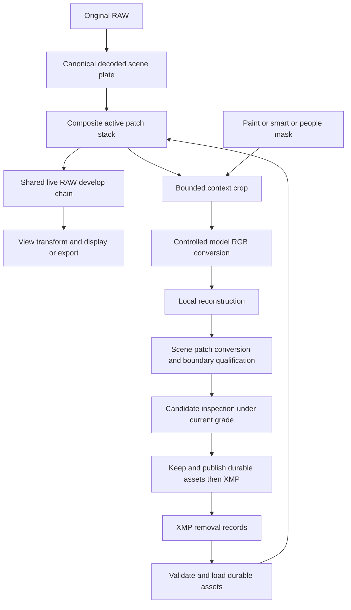

# Maple AI Object Removal Engineering Design RFC

Snapshot of the canonical [Page](https://chatgpt.com/space/page_7fd972e84c3c81919405004ebda76895) on October 5, 2026. Live Page remains authoritative.

**Status:** Research checkpoint; proposed architecture, not a qualified feature. **Updated:** October 5, 2026. **Product:** [PRD](https://chatgpt.com/space/page_4c1035a13efc8191b39a4a264e32144d). **Tracking:** [#3941](https://github.com/zubair-io/Maple/issues/3941), [epic #1472](https://github.com/zubair-io/Maple/issues/1472).

## October 5 research checkpoint

[Code, evidence and session handoff](https://github.com/zubair-io/Maple/blob/codex/removal-research-handoff/tools/removal/research/2026-10-05/README.md) · [Active quality investigation #3941](https://github.com/zubair-io/Maple/issues/3941).

Completed: 90 comparison generations (LaMa 512/768/1024, FLUX.2 Klein 4B 512/1024, Qwen Image Edit 2511 512) and 24 matched LaMa/Qwen mask-expansion generations. Both LaMa and Qwen remain useful research candidates; neither is a qualified production winner. Expanded masks improve some boundaries, but Qwen can still regenerate people and indoor floor artifacts persist.

The model sees a downsampled RGB context crop. Current native-size outputs use bilinear enlargement; they do not demonstrate native generated detail. RAW exposure/WB and outside-mask checks are distinct from perceptual fill quality. Case 5's saved results lack calibrated RAW/WB qualification; #4283 is now closed, which does not retroactively validate those outputs.

The next proposed investigation is native-detail reconstruction from fixed successful coarse fills, tracked in #3941. It has not started. Quality is the current experiment priority; production latency, memory, portability and colour gates remain required before shipping.

Implement RAW object removal as an asynchronous mask-and-reconstruction operation. Persist accepted replacement pixels in scene-linear Rec.2020 and composite them before live user adjustments using the shared Rust core and wgpu chain. Selection models and reconstruction models are independent. Accepted results are durable edit assets rather than regenerable caches.

The foundation inventory below is historical evidence checked at `5647ec688f2abeaee9113fa2ba3ae9045c6283d3`, not a description of every later prototype change. The unsuccessful Mac prototype is preserved in [draft PR #4239](https://github.com/zubair-io/Maple/pull/4239). New standalone research and its exact source base are documented in the October 5 handoff; production native-detail, RAW behavior, deployment tiers, licensing and storage remain qualification gates.

## Decisions and invariants

| Decision        | Proposed contract                                                                                                                                                                                               |
| --------------- | --------------------------------------------------------------------------------------------------------------------------------------------------------------------------------------------------------------- |
| Working data    | RGB calculations remain f32 linear Rec.2020 D65. Persisted patch pixels and coverage may use qualified fp16 encoding. Values above 1 and valid negative scene values are not clipped in the main develop chain. |
| Pipeline        | Composite after demosaic/calibration at a qualified pre-user-grade seam. Apply the visible user grade and one final view transform afterward.                                                                   |
| Inference input | A dedicated controlled rendering of the canonical scene plate, excluding arbitrary creative edits. Its display conversion is confined to the inference branch.                                                  |
| Default profile | The visible default stays Auto. Removal does not switch the editor to Neutral.                                                                                                                                  |
| Persistence     | XMP is authoritative for ordered operations and asset references. Accepted pixel/mask assets must survive cache cleanup and travel with the edit.                                                               |
| Rendering       | One Rust CPU reference and one wgpu/WGSL develop implementation. Platform inference adapters do not duplicate colour math.                                                                                      |
| Slider path     | No inference, file reads, model provisioning, patch-blob parsing, resource creation, or new removal-specific allocation per slider tick.                                                                        |
| Scope           | Mac feasibility first, followed by qualified ports. Portable accepted-edit rendering remains required for clients that open those edits. No cloud photo upload in the proposed first release.                   |

Durable removal assets extend the current statement that all non-XMP artifacts under `.maple/` are disposable. Before product enablement, revise that documentation and cache-clear behavior explicitly. This RFC does not authorize modifying originals or quietly reclassifying their derivatives.

## Existing implementation and gaps

| Foundation checked in the current tree                                                                        | Remaining work                                                                                                                                                                           |
| ------------------------------------------------------------------------------------------------------------- | ---------------------------------------------------------------------------------------------------------------------------------------------------------------------------------------- |
| `raw-core/src/types/inpaint.rs` defines `Removal`, `BakeGrade`, `InpaintPatch`, and compact JSON XMP helpers. | Selection mask persistence, stable operation identity, anchor metadata, asset validation, dependency tracking, and editable host models.                                                 |
| `pipeline/inpaint_store.rs` implements the MIPF fp16 patch codec.                                             | Durable storage adapters, atomic publication, retention, backup/sync, and corruption recovery.                                                                                           |
| `stages/inpaint_composite.rs` bilinearly resamples and blends ordered patches.                                | Full-frame/tile coordinate qualification and persistent GPU resources.                                                                                                                   |
| `pipeline/scene_linear_chain/patches.rs` exposes CPU patch wrappers.                                          | Full decode/export integration and every rendering consumer. The wrappers allocate intermediate buffers; they are reference/fallback paths, not the performance design for live sliders. |
| `raw-ffi/src/scene_linear_chain_patches.rs` exposes C ABI patch entries.                                      | Swift integration, WASM worker messages/session integration, and GPU integration.                                                                                                        |
| `view/agx_inverse.rs`, `view/grade_inverse.rs`, and seam tests provide a synthetic inverse spike.             | Actual camera-WB frame, current profile path, finite precision, real RAW boundaries, and native resolution qualification.                                                                |

The original inverse spike covers simplified WB/exposure/AgX behavior, not a full photographic grade inverse. A later Mac prototype exposes removal but failed qualification; UI availability is not a shipping-quality claim. The live chain uses camera-calibrated WB deltas. The newer photographic-input experiments improve some fills but still do not establish native-detail or arbitrary HDR recovery.

## Architecture and ownership

Rust owns mask rasterization and morphology, colour conversion, canonical patch validation/codec, blending, coordinates, and deterministic composition. `raw-gpu` owns the equivalent WGSL implementation. Codegen owns constants and cross-language schemas. Hosts own model lifecycle, storage I/O, task cancellation, UI, and bindings.

Use concrete reconstruction adapters for the two current research candidates, LaMa and Qwen. Both receive the same request identity, source crop, selection and protection contract; each returns its own candidate and provenance. Keep reconstruction separate from detail refinement. Requesting both does not mandate simultaneous model residency: schedule serially or concurrently according to measured memory, with independent progress/cancellation and stale-result guards. Store generated candidate pixels and model/version/settings/seed/mask provenance so switching candidates does not rerun inference. Persist the accepted patch independently of model availability. This is a design decision, not implemented integration; do not introduce a general plugin framework.

## Canonical scene anchor and inference encoding

Define one source-space plate at the composition seam, with source dimensions, DefaultCrop origin, decoder/calibration version, decode WB anchor/frame, profile-dependent upstream state, and upstream repair/decode settings recorded in an anchor fingerprint. The accepted stack must use that plate consistently at viewport, tile, and export resolutions.

The first experiment builds inference RGB from this plate using a fixed, documented photographic transform with explicit exposure and primary/transfer conventions. Do not use a screen capture or bake current HSL, Auto appearance fitting, curves, local contrast, grain, local adjustments, or arbitrary user exposure into the accepted patch. Preserve the photographer's visible settings for candidate inspection.

A model-compatible SDR encoding followed by bounded inverse conversion is the baseline experiment. Reversible log encoding is a comparison experiment, not a selected architecture: pretrained photographic models may fail on log inputs, and ACEScct is not inherently confined to zero through one. Conversion must handle finite range, out-of-gamut colours, negative calibrated values, and quantization without claiming sensor recovery.

The selected transform and inverse must be named and versioned in the recipe. Any inference-branch compression or gamut loss must be measured and must never alter the unmasked source plate. No mathematical inverse can recover scene information the RGB conversion discarded.

WB conversion must use the actual decode-exported camera frame and anchor, or an equivalent qualified canonicalization, rather than the spike's generic CAT16 inverse. Changing the live WB applies the same calibrated delta to plate and patch. Test changing WB before removal, reopening an XMP with saved WB, and changing WB afterward.

Candidate inspection runs the accepted/candidate stack through the current Auto profile and complete live grade. A separate inference plate does not change the product's default profile.

## Selection masks and coordinates

Use three distinct masks: selection intent, reconstruction hole, and composite coverage. The intent mask is editable and persisted; the reconstruction hole expands it to cover contaminated boundaries; coverage is fully opaque over unwanted-object interiors and transitions in a qualified boundary region.

Canonical coordinates are normalized over the full DefaultCrop image before EXIF display orientation and user crop/perspective presentation. Pixel rectangles use documented half-open bounds and pixel-center sampling. Map screen input through the inverse presentation geometry into this canonical space; orientation, lens geometry, and perspective mappings must correspond to the actual seam. Define out-of-frame samples and image-edge padding explicitly. Existing carriers imply DefaultCrop coordinates but do not establish tile correctness by themselves.

Rasterize brush strokes deterministically in Rust. Smart paint samples positive/negative prompts from strokes and refines using an image embedding cached once per canonical image revision; return an actual mask, not a list of semantic guesses. Newer selection revisions supersede older inference results.

Person detection returns instances and confidence. A class-aware person detector supplies boxes/masks if the promptable segmenter cannot discover people by itself. The initial subject-protection rule uses explicit user keep selections plus a conservative, corpus-qualified policy; uncertain cases remain unselected or visibly uncertain. Relative depth is not a first-release dependency. Distinguish detection failure from no people found.

Dilation and coverage falloff are measured in canonical source pixels and scaled to each render target. Do not adopt fixed 3–8 pixel values without calibration. Clip expansion against explicitly protected regions so removing a nearby person cannot damage a kept subject. Shadows/reflections are manual refinements in this release.

Person selection UI may group one confirmed Remove action, but preserve individually addressable records. Connected or overlapping holes may require joint reconstruction; one joint reconstruction unit then appears as a named group. Disabling a member of a jointly generated group requires explicit regeneration, because independent per-person toggles would misrepresent the baked pixels.

## Context resolution and reconstruction quality

Compute the reconstruction-mask bounds and expand them with a measured context policy that respects image edges, kept subjects, and surrounding structure. Start the experiment with approximately 1.5–2 times the bounding-box dimensions centered on the hole, then measure sensitivity; this is not a guaranteed production factor.

Initial selection/detection may use a reduced image, but small/distant people need crop refinement and the benchmark must measure misses caused by reduction. Reconstruction operates on bounded crops, not a full 100MP tensor.

A coarse structure pass and native-detail refinement may be needed for large holes. Plain independent sliding-window generation is not accepted merely because its overlap can be blended: inconsistent horizons, railings, or bricks can survive blending. Qualify the exact reconstruction strategy; cap unsupported regions and offer selection refinement if no native-detail solution meets the bar.

Only coverage-supported patch pixels replace the source plate. A low-resolution candidate may assist progress, but Keep requires the final qualified resolution and export uses those same accepted pixels. Preview and export never independently rerun the model.

Noise matching is evaluated at the actual seam. Measure residual noise in suitably flat, unmasked context and account for already-applied chroma prefilter, BM3D, and capture sharpening. Do not estimate noise from textured foliage alone or assume pure Gaussian noise. If correction is needed, use a deterministic, versioned procedure and store its final result. Later grain/NR applies consistently through the normal pipeline.

Begin with expanded reconstruction holes and bounded scene-linear coverage blending. Poisson or multiband blending is an escalation justified by failures, not a default dependency. It must have finite support, preserve unmasked pixels, and obey CPU/GPU parity. Quantify any colour correction using the context boundary rather than allowing uncontrolled global edits.

## Model qualification and runtime placement

| Task                 | Candidate and evidence                                                                                                                                 | Qualification needed                                                                                                                           |
| -------------------- | ------------------------------------------------------------------------------------------------------------------------------------------------------ | ---------------------------------------------------------------------------------------------------------------------------------------------- |
| Prompted object mask | SAM 2.1 Tiny/Small, compared with EfficientSAM. SAM 2 publishes Apache-2.0 checkpoint licensing; EfficientSAM publishes encoder/decoder ONNX examples. | Boundary accuracy, prompt refinement, small objects, conversion/operator coverage, warm/cold latency, memory, and deployed artifact licensing. |
| Individual people    | Apple Vision is an Apple candidate; a shared compact detector plus promptable segmenter is the cross-platform candidate.                               | Whole person recall, retained-subject false selection, crowds, distant people, runtime parity, and exact checkpoint terms.                     |
| Local reconstruction | MI-GAN and LaMa. MI-GAN publishes a weights license and RGB/mask ONNX pipeline; LaMa is a larger-context/periodic-structure comparison.                | Native-resolution quality, licensing of exact weights, crop policy, accelerator fallbacks, noise/seams, and memory.                            |

No production model is qualified by this RFC. The original candidate table above records the initial shortlist; current reconstruction research retains Big-LaMa and Qwen Image Edit 2511 after the Klein comparison. Both remain swappable candidates, without declaring a universal winner. Selection-model qualification is separate. Apple Vision is not portable to Web, and checkpoint/runtime licensing must be assessed for the exact deployed artifacts.

Apple evaluates the existing ONNX Runtime path with Core ML where supported or a qualified Core ML model artifact. iOS deployment must use the application's supported static/runtime packaging; macOS conversion success does not establish iPhone or iPad support. Web evaluates ONNX Runtime Web in a dedicated worker with WebGPU and a qualified WASM fallback. Presence of WebGPU does not establish support for every exported model operator.

Native and browser inference may produce numerically different proposals. Rendering parity is tested using identical saved masks/patches; selection parity is evaluated separately against the same labeled corpus.

Provision versioned model artifacts with checksums, origin, licenses, normalization, input/output definitions, and measured support tiers. Downloading a model is separate from processing a photo. Resume interrupted downloads safely and verify before activation. Operator-tunable settings use Maple's settings system; no new feature env vars.

## Proposed operation schema

Evolve `papp:InpaintRemovals` from the current schema-2 record with a versioned schema-3 `kind=removal` record. This is a proposed schema contract; it must pass codegen and real XMP cross-language tests before enablement.

| Field                        | Purpose                                                                                                                                                                          |
| ---------------------------- | -------------------------------------------------------------------------------------------------------------------------------------------------------------------------------- |
| schema and kind              | Identify the exact reader contract; unsupported versions remain preserved but cannot be rendered as supported.                                                                   |
| id and active                | Stable identity and explicit enable state; array order is composition order.                                                                                                     |
| region and source dimensions | Normalized placement plus canonical dimensions and coordinate revision.                                                                                                          |
| patch and selectionMask      | Content digests of the immutable accepted RGB/coverage patch and editable intent mask.                                                                                           |
| anchor                       | Decode/calibration revision, WB frame/anchor, upstream source geometry/profile/decode state fingerprint.                                                                         |
| recipe                       | Model artifact digest/version, inference transform/version, crop/scale, masks/morphology, runtime revision, and noise/blend procedure. Record a seed only if the model uses one. |
| dependencies                 | Earlier removal identities and accepted patch digests visible in the generation context.                                                                                         |
| sourceFingerprint            | Existing stable asset identity plus validated source content/metadata identity; do not bind an edit to an absolute path.                                                         |

The exact anchor/recipe members become typed shared fields after the qualification experiment establishes what is required. Do not add arbitrary blend modes, z-index, speculative configuration maps, or editable runtime parameters. RGB and coverage pixels are out of band.

The current carrier is already tagged schema 2, but its reader does not establish strict schema-version dispatch. Add that explicitly. Continue reading schema-2 records, preserve their blobs without regeneration, and upgrade only on an explicit authored edit. A legacy asset that lacks sufficient anchor provenance is visibly unqualified until compatibility is established.

Preserve unknown record kinds, future versions, and unrelated foreign XML byte-for-byte through supported read-modify-write paths. Parse recognized malformed records as errors; do not drop them. A new kind can render only after an explicit version-aware reader. Add a sidecar capability requirement and version-aware preflight to updated Maple consumers so unsupported active edits block incomplete export. Previously shipped clients cannot be made safe by adding metadata they do not recognize; they remain unsupported consumers of schema-3 edits. Release authoring only after every supported rendering consumer has the guard, and document the minimum compatible versions for users sharing XMP with older installations. The current schema-2 parser reads known fields without dispatching on schema; do not assume that incrementing schema alone forces an old client to reject a new record. The exact wire transition must be tested against existing readers before schema-3 is finalized.

The serialized selection mask is the portable editing source of truth. Prompt history/embeddings are session aids and never required to render an accepted result. Disable copying these source-specific operations through adjustment transfer.

## Durable asset storage and commit protocol

For filesystem/SMB sources, resolve digest-addressed assets under `.maple/inpaint/` with safe filenames derived from validated digests. Never concatenate arbitrary sidecar strings into a path. Keep temporary candidates separate from committed assets.

Reuse MIPF for the first qualified pixel codec: its payload is RGB fp16 plus fp16 coverage, or 8 bytes per patch pixel plus a 32-byte header. A 2048 by 2048 patch is approximately 32 MiB before compression. Validate finite pixels, valid coverage, dimensions, bounds, digest, and maximum decoded bytes before allocation. fp16 qualification includes overflow, subnormal, and conversion-error tests.

Benchmark a lossless envelope around the existing codec before adding a container dependency. EXR ZIP/PIZ and lossless JXL are alternatives if measured portability, decode memory, and bit preservation justify them. DWAB is lossy and is not the first accepted-edit archival format. No claimed percentage savings enters the shipping budget without actual patch measurements.

**Keep transaction**

1. Recheck asset identity, selection revision, source anchor, and committed stack revision against the job snapshot.

2. Validate the final candidate mask/patch and ensure the destination has capacity.

3. Write immutable assets to temporary files or a transactional object store, verify digests, then publish them durably.

4. Atomically publish the XMP references using the existing sidecar conflict/passthrough rules. Add the undo/history revision only after successful persistence.

5. Publish the committed render revision and invalidate affected derivatives.

A failure before XMP publication leaves the previous edit authoritative. Newly published but unreferenced blobs are harmless orphans; collect them only after checking current sidecars, history, undo, and in-flight transactions. A failure after a confirmed XMP write must be recovered by rereading that revision, not blindly duplicating the operation. File systems without atomic rename require an adapter-specific journal/recovery mechanism.

Retain referenced assets across cache clearing, model upgrades, and application updates. Initial release performs no automatic deletion of accepted assets merely because a removal is disabled or deleted; history may still reference them.

## Storage adapters and portability

| Source                                        | Proposed persistence behavior                                                                                                                                                                                   |
| --------------------------------------------- | --------------------------------------------------------------------------------------------------------------------------------------------------------------------------------------------------------------- |
| Writable filesystem or SMB                    | Publish digest assets before sidecar; backup and file operations carry all referenced assets. Handle permission loss and network interruption.                                                                  |
| Browser File System Access                    | Persist companion XMP/assets through the granted directory and atomic/recoverable adapter; permission revocation keeps candidates uncommitted.                                                                  |
| Browser import without directory access       | Transactionally store the edit in IndexedDB, request persistent storage where available, identify it as Stored locally, and offer a portable edit-package download. Browser storage is not a guaranteed backup. |
| Maple server or cloud-backed source           | Upload verified immutable assets to the source's asset store before atomically/CAS publishing sidecar references. Processing remains local; asset synchronization is distinct from cloud inference.             |
| PhotoKit or another read-only original source | Use the existing writable sidecar companion mechanism plus a durable removal asset store. Do not enable Keep until backup/restore and asset identity mapping are qualified.                                     |

Export a portable edit package with a versioned manifest, XMP, masks, patches, digests, and stable RAW identity/reference. It need not duplicate the RAW by default. Import validates all assets before activation and maps to the intended original using verified identity; it never overwrites original pixels. Package paths must reject traversal.

Move/copy/rename must complete required asset transfer before declaring an edited asset successfully transferred. Synchronization may temporarily have a sidecar ahead of its blobs; show pending assets and withhold incomplete export until references resolve. Concurrent sidecar revisions use the existing conflict rules rather than silently merge two ordered removal stacks.

Missing/corrupt assets keep the record and offer restore, locate edit package, explicitly disable, or explicitly regenerate. Regeneration is a new candidate requiring Keep and cannot promise the exact earlier pixels. Cache-clearing UI and backup docs must distinguish disposable previews from durable edit assets.

## Ordered composition and change dependencies

Compose active records in XMP array order using `out = source * (1 - coverage) + patch * coverage`. Zero coverage takes an explicit no-op branch so untouched source values remain bit-identical at the composition seam.

A generation job reads the canonical plate with the active earlier patch stack. Record all earlier patches whose coverage intersects its context crop. After a committed operation is replaced/toggled/deleted, later dependent patches keep their accepted pixels and become Needs review. Do not automatically regenerate them. Regeneration replaces a selected record in place, preserving list order, and updates its dependency snapshot after Keep.

Upstream decode changes such as demosaic, camera calibration, lens geometry, decode noise/capture-sharpen settings, or a profile change that alters the canonical plate require anchor revalidation. Rebase only where a conversion has been qualified. Otherwise display a needs-review/incompatible-anchor state and require explicit regeneration before export. Exposure/WB changes handled by the qualified live chain do not invalidate the patch.

Existing clone/heal operations run in the decode product before the removal seam. A later change to those operations invalidates the anchor/dependency assessment; do not invent a unified cross-tool z-order. Undo/redo restores operation and dependency state plus retained assets. Third-party XML is preserved throughout.

## Rendering tiles export and caches

The CPU compositor is the reference oracle. Add an ordered WGSL compositor or compose a prepared GPU scene texture once per decoded-buffer/active-stack revision before the normal live develop chain. Evaluate which avoids both per-tick work and an unacceptable additional full-resolution texture. The renderer consumes stable session handles/resources; the host does not send or deserialize patch blobs per slider tick.

Viewport renders downsample the canonical accepted patches and coverage using a shared qualified rule. Deep-zoom tiles gather only intersecting patch regions with the source-space window mapping and correct interpolation footprint. Current normalized placement alone is insufficient for a tile whose origin is nonzero. Downstream spatial stages keep their existing padding and frame anchors.

Full export resolves the exact saved asset set and composites at the same seam before user grade. Integrate both the live-buffer and full decode/develop pathways; implementing only the existing FFI wrapper does not cover CLI/API/WASM export. Device authoring support is not required to render an accepted asset.

Keep, replacement, toggle, deletion, and source-anchor changes update the render revision. Key prepared plate/resources by source identity, anchor, active ordered patch digests, and existing pipeline version; fold committed sidecar revision/mtime into rendered previews/tiles as documented. A slider-only grade change reuses the prepared source/stack. Model-version changes do not invalidate accepted pixel assets.

Invalidate or regenerate edited shared thumbnails and previews using the committed removal revision. The unedited embedded-JPEG fast path must not run for an asset carrying active removals. Served thumbnail/preview freshness must include removal edits, even when the original file is unchanged. Pipeline-version bumps follow existing output-version rules; a cache-version bump cannot substitute for integrating a missing render path.

## Session concurrency and failure states

Session states are Idle, Selecting, Resolving selection, Generating, Inspecting candidate, Committing, and Saved, with explicit Failed, Incomplete assets, and Needs review states. A candidate affects temporary inspection only; the committed XMP/undo model changes at Keep.

Every job carries immutable asset identity, session generation, selection revision, source anchor, and removal-stack revision. Apply a result only if these still match. Cancel or discard on navigation, a newer stroke/job, or an upstream input change. A cancelled job may finish on a runtime that lacks interruption, but cannot publish or commit. Change of visible downstream grade can re-render a still-valid candidate without re-running inference.

Limit reconstruction concurrency per device using measured memory, initially one active generation per editor. Backpressure and resource release are explicit. Never block the UI thread or render worker with model inference. Keep progress factual and cancellation immediate at the UI level.

Typed errors cover model not provisioned, unsupported operators/device, memory limit, source changed, selection empty/invalid, region outside qualified limits, storage quota/permission, sidecar conflict, corrupt/unknown asset format, missing dependencies, and incompatible anchor. No error path silently emits an image with an active removal omitted.

Diagnostics record stage duration, tensor/crop dimensions, model revision, allocation peaks, and error category without pixels, masks, person identities, or sensitive source paths. Expose any operator-adjustable settings through the existing settings system.

## Qualification and requirement traceability

| PRD requirements    | Engineering evidence                                                                                                                              |
| ------------------- | ------------------------------------------------------------------------------------------------------------------------------------------------- |
| SEL1 and SEL2       | Deterministic brush/mask fixtures; positive/negative prompt tests; stale-result cancellation; warm/cold p50/p95 timings.                          |
| SEL3 and SEL4       | Labeled crowds, distant people, portrait groups, overlap, and kept-subject cases; detection recall and false-selection/boundary measurements.     |
| SEL5 and SEL6       | Manual shadow/reflection additions; all EXIF orientations, crop/straighten/perspective/lens mapping, image edges, and zoom/tile cases.            |
| RAW1 through RAW3   | Original hash invariance; current Auto and selectable Neutral; actual camera-WB frame; empty-stack identity; before/after persistence.            |
| QUAL1 through QUAL4 | Structured 100 percent artifact assessment plus boundary colour, detail/noise statistics, native-resolution exports, and kept-subject protection. |
| DATA1 through DATA3 | Real XMP/asset round trips on Rust/Swift/TS/C#; crash injection at every Keep boundary; move/copy/backup/package/sync/restore.                    |
| DATA4 through DATA6 | Missing/corrupt assets, future schema, legacy schema 2, anchor changes, overlapping edits, history/undo retention, and model removal/upgrade.     |
| Responsiveness      | Existing slider/perf gates with 0/1/10 active patches, 100MP scenes, connected large masks, high zoom, and memory pressure.                       |
| Accessibility       | Person/removal list keyboard and assistive-technology tests; labelled controls; phone/tablet/desktop session preservation.                        |

Separate four gates. First, exact mask/asset preservation and untouched composition-seam pixels. Second, CPU/GPU and Apple/Web pixel parity using identical accepted patches. Third, colour conversion/re-grading correctness. Fourth, semantic plausibility of reconstructed content. One gate does not replace another.

For the colour gate, use an identity reconstruction to isolate RGB conversion, fp16 storage, blend, and current WB frame. Test real RAWs, synthetic scene ramps including values above 1 and negative values, broad exposure pushes including plus/minus 3 EV, WB/tint extremes, high-chroma colours, and deep shadows/speculars. Measure Delta E2000, bias, finite-value behavior, and frame/tile seams by tonal zone. Run the canonical ACR harness and parity gates without loosening existing budgets. Generated-background plausibility is assessed separately.

Proposed shipping targets are unchanged slider 16ms target/50ms hard limit, one-frame brush feedback, and warm smart-selection p95 at or below 250ms. Establish detection/generation time, peak memory, maximum region, and patch-count ceilings per support tier from the experiment before implementation is declared qualified. Set numeric perceptual/selection budgets from the consented corpus and ratchet them; this document does not invent passing measurements.

Archive model/artifact hashes, recipe/anchor, device/OS/browser/runtime, warm/cold timings, corpus revision, candidate masks/patches, and metric outputs with the qualification run. Missing fixtures may skip generic CI but never satisfy release qualification.

## Implementation sequence and review decisions

| Delivery track                              | Dependency and exit                                                                                                                                                          |
| ------------------------------------------- | ---------------------------------------------------------------------------------------------------------------------------------------------------------------------------- |
| Canonical anchor and colour experiment      | First establish an actual camera-WB/Auto-compatible seam and bounded inference conversion. Identity and generated-patch tests must both pass.                                |
| Segmentation and reconstruction experiments | Can proceed alongside each other using shared consented crops; select models only from documented quality, deployment, licensing, and memory evidence.                       |
| Schema and durable assets                   | Define version dispatch, old-client export guards, typed records, safe codec validation, commit recovery, and storage adapters before enabling Keep.                         |
| Shared rendering integration                | CPU oracle, WGSL resources, live/sized/tile/full export, derivative freshness, and all required bindings must pass.                                                          |
| Apple and Web interaction                   | Complete Paint, Smart paint, Background people, history/dependencies, and accessibility. These host tracks can proceed independently after their shared contracts stabilize. |
| End-to-end release qualification            | Validate complete authoring and portable rendering on named support tiers and source adapters.                                                                               |

Track implementation under epic 1472, reconcile its stale phase status and Apple-only scope when the documents are adopted, and link resulting sub-issues to these contracts. No new tickets, issue edits, code changes, deployment, or benchmark results are claimed by document creation.

Required review decisions: final canonical anchor and upstream-change policy; model artifacts/runtime/operator support; inference transform and quality budgets; source-adapter durable destinations; support tiers and generation/memory limits. Lossless compression selection is a measurement decision. Cloud reconstruction and automatic shadow inference remain out of scope.

Alternatives declined for this release: screen-image generation with arbitrary inverse grade, pre-demosaic RGB insertion, post-display baked overlays, fit-preview patches enlarged for export, accepted-patch LRU eviction, a separate Apple Metal develop/compositor implementation, speculative provider frameworks, automatic regeneration after model/upstream changes, and independent tiles assumed coherent without testing.

## Sources and verification limits

Repository evidence is pinned to commit `5647ec688f2abeaee9113fa2ba3ae9045c6283d3`. The current code takes precedence over historical milestone wording.

- [Inpaint carriers and schema](https://github.com/zubair-io/Maple/blob/5647ec688f2abeaee9113fa2ba3ae9045c6283d3/src/raw-pipeline/raw-core/src/types/inpaint.rs)

- [Patch wrappers](https://github.com/zubair-io/Maple/blob/5647ec688f2abeaee9113fa2ba3ae9045c6283d3/src/raw-pipeline/raw-core/src/pipeline/scene_linear_chain/patches.rs)

- [Current WB frame options](https://github.com/zubair-io/Maple/blob/5647ec688f2abeaee9113fa2ba3ae9045c6283d3/src/raw-pipeline/raw-core/src/pipeline/scene_linear_chain/options.rs)

- [Patch byte codec](https://github.com/zubair-io/Maple/blob/5647ec688f2abeaee9113fa2ba3ae9045c6283d3/src/raw-pipeline/raw-core/src/pipeline/inpaint_store.rs)

- [Maple pipeline](https://github.com/zubair-io/Maple/blob/5647ec688f2abeaee9113fa2ba3ae9045c6283d3/docs/pipeline.md), [XMP contract](https://github.com/zubair-io/Maple/blob/5647ec688f2abeaee9113fa2ba3ae9045c6283d3/docs/xmp-canonical-format.md), [caches](https://github.com/zubair-io/Maple/blob/5647ec688f2abeaee9113fa2ba3ae9045c6283d3/docs/caching.md), [zoom](https://github.com/zubair-io/Maple/blob/5647ec688f2abeaee9113fa2ba3ae9045c6283d3/docs/zoom.md)

- [SAM 2](https://github.com/facebookresearch/sam2), [EfficientSAM](https://github.com/yformer/EfficientSAM), [Apple person instance masks](https://developer.apple.com/documentation/vision/vngeneratepersoninstancemaskrequest)

- [MI-GAN input contract](https://github.com/Picsart-AI-Research/MI-GAN), [MI-GAN weights license](https://github.com/Picsart-AI-Research/MI-GAN/blob/main/LICENSE-WEIGHTS), [LaMa](https://github.com/advimman/lama), [CoreMLaMa deployment caveat](https://github.com/mallman/CoreMLaMa)

- [ONNX Runtime Core ML](https://onnxruntime.ai/docs/execution-providers/CoreML-ExecutionProvider.html), [ONNX Runtime WebGPU](https://onnxruntime.ai/docs/tutorials/web/ep-webgpu.html)

- [ACEScct range](https://docs.acescentral.com/encodings/acescct/), [OpenEXR compression](https://openexr.com/en/latest/TechnicalIntroduction.html#data-compression), [JPEG XL floating-point/profile metadata](https://libjxl.readthedocs.io/en/latest/api_metadata.html), [Ultralytics licensing](https://docs.ultralytics.com/)

Upstream documentation establishes capabilities and declared licenses, not Maple benchmark performance, checkpoint provenance clearance, inference quality, or exact cross-platform determinism. Those remain qualification deliverables.
